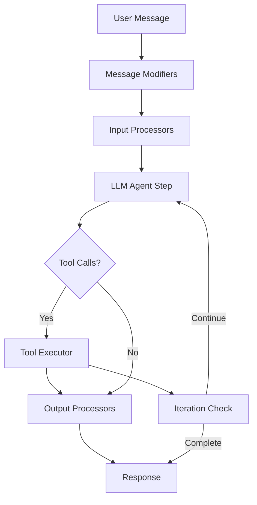

# CodeBolt Gemini Agent

🤖 **A sophisticated AI agent implementation powered by Google's Gemini model**, integrated with CodeBolt's agent processor framework for seamless development workflow automation.

## 📖 Table of Contents

- [Overview](#overview)
- [Features](#features)
- [Architecture](#architecture)
- [Installation](#installation)
- [Quick Start](#quick-start)
- [Configuration](#configuration)
- [API Reference](#api-reference)
- [Built-in Tools](#built-in-tools)
- [Message Processing Pipeline](#message-processing-pipeline)
- [Development](#development)
- [Examples](#examples)
- [Troubleshooting](#troubleshooting)
- [Contributing](#contributing)
- [License](#license)

## 🎯 Overview

The **CodeBolt Gemini Agent** is a production-ready AI agent that combines Google's powerful Gemini language model with CodeBolt's comprehensive agent processing framework. It provides intelligent code assistance, file operations, and workflow automation capabilities.

### Key Benefits

- 🚀 **Intelligent Code Assistance**: Leverages Gemini's advanced reasoning capabilities
- 🔧 **Comprehensive Tool Integration**: Built-in file operations and extensible tool system
- 🛡️ **Robust Error Handling**: Advanced loop detection and safety mechanisms
- 📊 **Performance Monitoring**: Built-in telemetry and performance tracking
- 🔄 **Flexible Processing**: Multiple processing modes for different use cases

## ✨ Features

### Core Capabilities

- **Multi-Modal Input Processing**: Handle text, URLs, and image attachments
- **Advanced Tool Execution**: Built-in file operations with retry logic
- **Intelligent Loop Detection**: Prevent infinite loops and improve safety
- **Context Management**: Automatic project and directory context awareness
- **Chat Compression**: Intelligent conversation history management
- **Token Management**: Optimize token usage and prevent limits
- **Telemetry & Monitoring**: Track performance and usage metrics

### Agent Features

- **Multi-Language Support**: Works with TypeScript and other supported languages
- **Framework Agnostic**: Compatible with various development frameworks
- **YAML Configuration**: Easy configuration through YAML files
- **Hot Reload Support**: Real-time development with automatic updates
- **Error Recovery**: Graceful error handling and recovery mechanisms

## 🏗️ Architecture



### Core Components

#### 1. **Message Modifiers**
- `BaseContextMessageModifier`: Adds system context and metadata
- `WorkingDirectoryMessageModifier`: Provides directory structure context
- `HandleUrlMessageModifier`: Processes and fetches URL content
- `ImageAttachmentMessageModifier`: Handles image inputs
- `AddToolsListMessageModifier`: Injects available tools information

#### 2. **Input Processors**
- `AdvancedLoopDetectionProcessor`: Detects and prevents infinite loops
- `TokenManagementProcessor`: Manages token limits and optimization
- `ContextManagementProcessor`: Handles project and IDE context
- `ChatCompressionProcessor`: Compresses conversation history

#### 3. **Output Processors**
- `ResponseValidationProcessor`: Validates tool calls and content
- `ChatRecordingProcessor`: Records conversation for analysis
- `TelemetryProcessor`: Tracks performance and usage metrics

#### 4. **Tool System**
- `ToolList`: Manages available tools and their metadata
- `ToolExecutor`: Executes tools with retry logic and error handling
- Built-in file operations tools

## 📦 Installation

### Prerequisites

- Node.js 18 or higher
- npm 10+ or pnpm
- TypeScript support

### Install the Agent

```bash
# Using npm
npm install @codebolt/geminiagent

# Using pnpm
pnpm add @codebolt/geminiagent

# Using yarn
yarn add @codebolt/geminiagent
```

### Development Setup

```bash
# Clone the repository
git clone https://github.com/codeboltai/codeboltjs.git
cd codeboltjs/agents/geminiagent

# Install dependencies
npm install

# Build the agent
npm run build

# Start development mode
npm run dev
```

## 🚀 Quick Start

### Basic Usage

The Gemini agent is designed to work seamlessly with CodeBolt's message handling system:

```typescript
import codebolt from '@codebolt/codeboltjs';

// The agent automatically handles incoming messages
// through the codebolt.onMessage() handler

// Send a message to the agent
codebolt.chat.sendMessage('Help me create a new React component', {});
```

### Manual Integration

For custom implementations:

```typescript
import { 
    RequestMessage, 
    LLMAgentStep, 
    ToolExecutor, 
    ToolListClass as ToolList 
} from '@codebolt/geminiagent';

// Initialize the agent components
const toolList = new ToolList([
    // Add your tools here
]);

const agentStep = new LLMAgentStep({
    toolList,
    llmconfig: {
        llmname: "gemini-pro",
        model: "gemini-pro",
        temperature: 0.7,
        maxTokens: 8192
    }
});
```

## ⚙️ Configuration

### Agent Configuration (codeboltagent.yaml)

```yaml
title: geminiagent
unique_id: geminiagent
initial_message: Hello! I'm your advanced AI developer. How can I assist you today?
description: Advanced Gemini-powered CodeBolt Agent

metadata:
  agent_routing:
    worksonblankcode: true
    worksonexistingcode: true
    supportedlanguages:
      - typescript
      - javascript
      - python
      - java
    supportedframeworks:
      - all

  defaultagentllm:
    strict: true
    modelorder:
      - gemini-pro
      - gemini-1.5-pro

  llm_role:
    - name: documentationllm
      description: LLM for documentation tasks
      modelorder:
        - gemini-pro
        - gpt-4-turbo
    - name: testingllm
      description: LLM for testing tasks
      modelorder:
        - gemini-pro
        - gpt-4-turbo
```

### TypeScript Configuration

The agent uses strict TypeScript configuration for type safety:

```json
{
  "compilerOptions": {
    "target": "ES2020",
    "module": "Node16",
    "moduleResolution": "node16",
    "strict": true,
    "esModuleInterop": true,
    "declaration": true,
    "sourceMap": true
  }
}
```

### Build Configuration

The agent uses esbuild for fast compilation:

```javascript
// build.mjs
import esbuild from 'esbuild';

esbuild.build({
  entryPoints: ['src/index.ts'],
  bundle: true,
  platform: 'node',
  target: 'node20',
  outfile: 'dist/index.js',
  format: 'cjs',
  external: ['bufferutil', 'utf-8-validate']
});
```

## 📚 API Reference

### Core Components

#### RequestMessage

Handles message modification and preprocessing:

```typescript
const messageModifier = new RequestMessage({
    messageModifiers: [
        new BaseContextMessageModifier({ /* options */ }),
        new WorkingDirectoryMessageModifier({ /* options */ }),
        // ... other modifiers
    ]
});

const modifiedMessage = await messageModifier.modify(originalMessage);
```

#### LLMAgentStep

Core processing component:

```typescript
const agentStep = new LLMAgentStep({
    inputProcessors: [/* processors */],
    outputProcessors: [/* processors */],
    toolList: toolList,
    toolExecutor: toolExecutor,
    llmconfig: {
        llmname: "gemini-pro",
        model: "gemini-pro",
        temperature: 0.7,
        maxTokens: 8192
    },
    maxIterations: 10
});

const response = await agentStep.step(message);
```

#### ToolExecutor

Manages tool execution with retry logic:

```typescript
const toolExecutor = new ToolExecutor(toolList, {
    maxRetries: 3,
    enableLogging: true
});

const result = await toolExecutor.executeTools({
    toolCalls: [/* tool calls */],
    tools: toolList,
    context: { /* context */ }
});
```

### Configuration Options

| Option | Type | Default | Description |
|--------|------|---------|-------------|
| `maxIterations` | number | 10 | Maximum processing iterations |
| `maxRetries` | number | 3 | Tool execution retry attempts |
| `temperature` | number | 0.7 | LLM response creativity |
| `maxTokens` | number | 8192 | Maximum token limit |
| `enableLogging` | boolean | true | Enable detailed logging |

## 🛠️ Built-in Tools

The agent includes a comprehensive set of file manipulation tools:

### File Operations

#### FileReadTool

```typescript
// Read file contents
const content = await fileReadTool.execute({
    filePath: '/path/to/file.txt'
});
```

#### FileWriteTool

```typescript
// Write content to file
await fileWriteTool.execute({
    filePath: '/path/to/file.txt',
    content: 'Hello, World!',
    encoding: 'utf8'
});
```

#### FileDeleteTool

```typescript
// Delete a file
await fileDeleteTool.execute({
    filePath: '/path/to/file.txt'
});
```

#### FileMoveTool

```typescript
// Move a file
await fileMoveTool.execute({
    sourcePath: '/path/to/source.txt',
    destinationPath: '/path/to/destination.txt'
});
```

#### FileCopyTool

```typescript
// Copy a file
await fileCopyTool.execute({
    sourcePath: '/path/to/source.txt',
    destinationPath: '/path/to/copy.txt'
});
```

### Custom Tool Development

Create custom tools by extending the base tool class:

```typescript
import { BaseTool } from '@codebolt/agent/processor';

class CustomTool extends BaseTool {
    constructor() {
        super(
            'CustomTool',
            'Description of what this tool does',
            {
                parameter1: 'string',
                parameter2: 'number'
            }
        );
    }

    async execute(params: any): Promise<any> {
        // Implement tool logic
        return {
            success: true,
            result: `Processed: ${params.parameter1}`
        };
    }
}

// Add to tool list
toolList.addTool(new CustomTool());
```

## 🔄 Message Processing Pipeline

The agent follows a sophisticated message processing pipeline:

### 1. Message Modification Phase

```typescript
// Context enrichment
BaseContextMessageModifier → WorkingDirectoryMessageModifier → 
HandleUrlMessageModifier → ImageAttachmentMessageModifier → 
AddToolsListMessageModifier
```

### 2. Input Processing Phase

```typescript
// Safety and optimization
AdvancedLoopDetectionProcessor → TokenManagementProcessor → 
ContextManagementProcessor → ChatCompressionProcessor
```

### 3. LLM Processing Phase

```typescript
// Core AI processing
LLMAgentStep.step() → Tool Call Detection → Tool Execution
```

### 4. Output Processing Phase

```typescript
// Validation and monitoring
ResponseValidationProcessor → ChatRecordingProcessor → 
TelemetryProcessor
```

### 5. Iteration Control

```typescript
// Loop management
Iteration Check → Continue/Complete Decision → Response Generation
```

## 🔧 Development

### Project Structure

```
geminiagent/
├── src/
│   └── index.ts          # Main agent implementation
├── dist/                 # Compiled output
├── llm-requests/         # LLM request/response logs
├── codeboltagent.yaml    # Agent configuration
├── package.json          # Dependencies and scripts
├── tsconfig.json         # TypeScript configuration
├── build.mjs             # Build script
└── README.md             # This documentation
```

### Available Scripts

```bash
# Build the agent
npm run build

# Development mode with watch
npm run dev

# Clean build artifacts
npm run clean

# Type checking
npx tsc --noEmit
```

### Debugging

The agent includes comprehensive logging:

```typescript
// Enable debug logging
console.log('[GeminiAgent] Processing message:', message);
console.log('[GeminiAgent] Tool calls detected:', toolCalls.length);
console.log('[GeminiAgent] Processing complete');
```

### LLM Request Logging

All LLM interactions are logged in the `llm-requests/` directory:

- `llm-request-*.json`: Request payloads sent to Gemini
- `llm-response-*.json`: Responses received from Gemini

## 📖 Examples

### Example 1: File Operations

```typescript
// User: "Read the contents of package.json"
// Agent will:
// 1. Detect file read request
// 2. Execute FileReadTool
// 3. Return file contents
```

### Example 2: Code Generation

```typescript
// User: "Create a new React component for a todo list"
// Agent will:
// 1. Analyze requirements
// 2. Generate component code
// 3. Use FileWriteTool to save the file
// 4. Confirm creation
```

### Example 3: Project Analysis

```typescript
// User: "Analyze the project structure and suggest improvements"
// Agent will:
// 1. Read project files
// 2. Analyze structure
// 3. Provide recommendations
// 4. Optionally implement changes
```

## 🔍 Troubleshooting

### Common Issues

#### 1. **Build Errors**

```bash
# Clear cache and rebuild
npm run clean
npm run build
```

#### 2. **Module Resolution Issues**

```bash
# Check TypeScript configuration
npx tsc --showConfig

# Verify dependencies
npm ls
```

#### 3. **Memory Issues**

```bash
# Increase Node.js memory limit
export NODE_OPTIONS="--max-old-space-size=4096"
npm run build
```

#### 4. **Tool Execution Failures**

Check the console logs for detailed error messages:

```typescript
// Enable verbose logging
const toolExecutor = new ToolExecutor(toolList, {
    maxRetries: 3,
    enableLogging: true
});
```

### Performance Optimization

1. **Token Management**: Adjust `maxTokens` based on your use case
2. **Compression Settings**: Fine-tune `compressionThreshold`
3. **Iteration Limits**: Optimize `maxIterations` for your workflows
4. **Tool Retries**: Balance reliability vs. performance with `maxRetries`

## 🤝 Contributing

We welcome contributions! Please follow these steps:

1. **Fork the Repository**
   ```bash
   git fork https://github.com/codeboltai/codeboltjs.git
   ```

2. **Create a Feature Branch**
   ```bash
   git checkout -b feature/amazing-feature
   ```

3. **Make Your Changes**
   - Follow TypeScript best practices
   - Add tests for new features
   - Update documentation

4. **Test Your Changes**
   ```bash
   npm run build
   npm run test
   ```

5. **Submit a Pull Request**
   - Provide clear description
   - Include test coverage
   - Update documentation

### Development Guidelines

- **Code Style**: Follow existing TypeScript conventions
- **Testing**: Add unit tests for new features
- **Documentation**: Update README and inline comments
- **Performance**: Consider token usage and execution time
- **Security**: Validate all inputs and handle errors gracefully

## 📄 License

This project is licensed under the **MIT License**. See the [LICENSE](../../../LICENSE) file for details.

---

**Built with ❤️ by the CodeBolt Team**

- 🌐 [Website](https://codebolt.ai)
- 📧 [Support](mailto:support@codebolt.ai)
- 📚 [Documentation](https://docs.codebolt.ai)
- 🐙 [GitHub](https://github.com/codeboltai)

*For more information about the CodeBolt ecosystem, visit our [main documentation](../../README.md).*