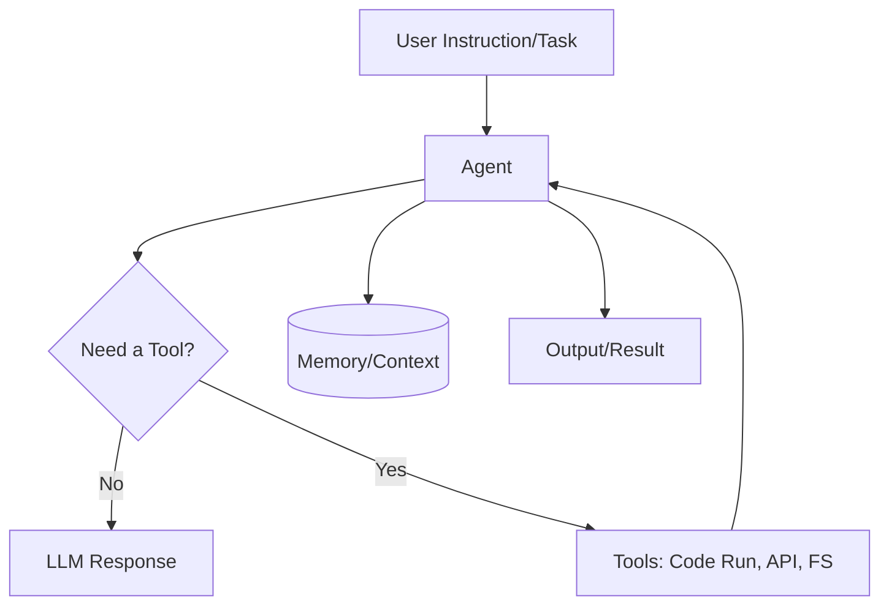

# Agent

An Agent is an intelligent assistant within Codebolt. It is powered by language models and designed to understand tasks, decide the next steps, use tools when necessary, and maintain context to deliver accurate results.

- Understand your instructions

- Decide what to do next

- Use tools when needed (for example, to run code or fetch data)

- Remember context so it gives you better answers

In short, an agent makes your interaction with Codebolt smarter and more useful.

**How to agent work**

- You just give the agent a task (e.g., “create a calculator app”).

- The agent will ask follow-up questions if needed.

- It will then generate code, run tools, or connect with other agents to complete the task.

- Agents can work alone or together in workflows, depending on your needs.

