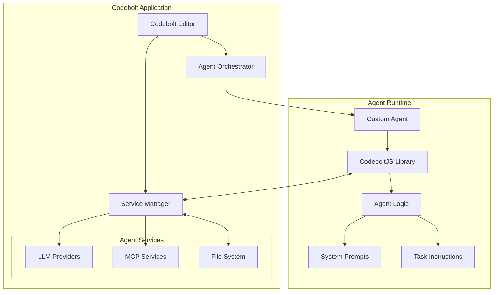
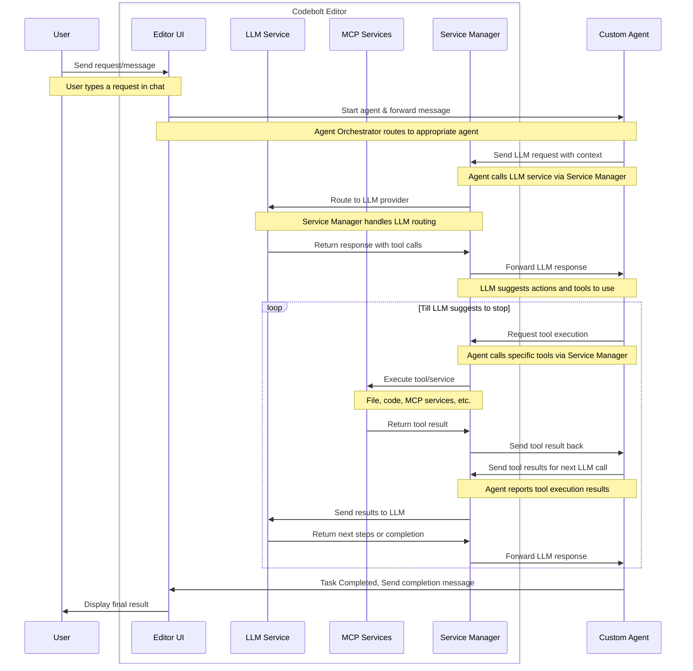

# Agent Introduction

Codebolt is an extremely powerful AI driven coding system. Think of Codebolt as the Selenium of code editors. Just like Selenium or Playwright lets you control an entire browser. Similarly, Codebolt allows agents to control the entire code editor. Codebolt has been built from ground up for the AI-Egentic era. 

Unlike other editors like cursor where they have a single agent that is the core of the application, CodeBolt takes a different approach where it allows you to write your own agents and the agent logics.

## What is a Codebolt Agent?

Codebolt agents are intelligent AI assistants that leverage Codebolt's APIs to interact with your code editor. They analyze user requirements, communicate with large language models (LLMs), and execute actions like code editing, file manipulation, and task automation within your development environment.

## What is it different?

Codebolt agents are fundamentally different from other agents like in cursors or trae. Other code editors provide you with an option to create a custom code agent only by changing the core prompt or by selecting the available tools. On the contrary, a code bolt agent provides you with actual editor APIs for you or the AI to interact with the editor. Code bolt agents are code based agents where you can write custom codes which might include any process, any workflows along with agentic AI logics. While we also support a very simple cursor style agent creation called as [remix agents](/docs/developer/agents/remixagents/aboutremixagents) but the real power of code bolt comes with custom code-based agents.

## How Agents Work

Codebolt agents operate through an agentic process flow that combines:

1. **User Intent Understanding**: Parsing and interpreting user requests
2. **Task Planning**: Breaking down complex tasks into actionable steps
3. **Tool Utilization**: Using available tools and APIs to accomplish tasks
4. **Code Manipulation**: Reading, writing, and modifying code files
5. **Decision Making**: Using LLM reasoning to make intelligent choices
6. **Result Delivery**: Providing feedback and results to users

## Agent Architecture

This is a very high level architecture of Codebolt and Agent Interaction. The Codebolt Application handles the orchestration of the agents based on the user chat and provides services for agents to use.




## Agent Flow

The following sequence diagram illustrates the complete flow of how a user request is processed through Codebolt and agents:



But again you are not limited to this flow. You can write your own agent logic and use the CodeboltJS library to interact with the editor.

## Sample Agent Flow Code

Here's a complete example of how an agent handles a user request using the **CodeboltJS library**:

```javascript
// Main agent entry point - handles incoming user messages
codebolt.onMessage((userMessage)=> {
    try {
        // 1. Extract context
        const projectContext = await codebolt.project.getContext();
        
        // 2. Get available tools for the agent
        const tools = await codebolt.tools.listToolsFromToolBoxes(["codebolt", "filesystem"]);
        
        // 3. Prepare conversation with system context
        const messages = [
            {
                role: "system",
                content: "You are a helpful coding assistant. Analyze the user request and use available tools to complete the task."
            },
            {
                role: "user", 
                content: `${userMessage}\n\nProject context: ${JSON.stringify(projectContext)}`
            }
        ];
        
        // 4. Start conversation loop with LLM
        let isTaskComplete = false;
        let conversationHistory = [...messages];
        
        while (!isTaskComplete) {
            // Send request to LLM with available tools
            const llmResponse = await codebolt.llm.chat(conversationHistory, tools);
            
            // 5. Process LLM response and execute tool calls
            if (llmResponse.tool_calls && llmResponse.tool_calls.length > 0) {
                // Execute each tool call requested by LLM
                for (const toolCall of llmResponse.tool_calls) {
                    const toolResult = await codebolt.tools.executeToolCall(toolCall);
                    
                    // Add tool result to conversation
                    conversationHistory.push({
                        role: "tool",
                        tool_call_id: toolCall.id,
                        content: JSON.stringify(toolResult)
                    });
                }
                
                // Get LLM's next response after tool execution
                const followUpResponse = await codebolt.llm.chat(conversationHistory, tools);
                
                // Check if LLM indicates task is complete
                if (followUpResponse.content.includes("task completed") || 
                    !followUpResponse.tool_calls) {
                    isTaskComplete = true;
                    
                    // 6. Send final response to user
                    return followUpResponse.content;
                }
            } else {
                // No tool calls needed, task is complete
                isTaskComplete = true;
                return llmResponse.content;
            }
        }
        
    } catch (error) {
        console.error('Error in agent:', error);
    }
});
```


### Code Explanation:

1. **Message Handling**: The agent listens for user messages via WebSocket connection
2. **Context Gathering**: Retrieves project context and available tools
3. **LLM Communication**: Sends user request with context to the LLM service
4. **Tool Execution Loop**: 
   - LLM responds with tool calls (file operations, code analysis, etc.)
   - Agent executes each tool via Codebolt's service manager
   - Results are sent back to LLM for next steps
5. **Task Completion**: Loop continues until LLM indicates the task is finished
6. **User Response**: Final result is sent back to the user through Codebolt UI

This example demonstrates the complete agent flow from the sequence diagram above, showing how agents use the **CodeboltJS library** to:

## Agent Types and Use Cases

### 1. **Code Generation Agents**
- Generate React components, API endpoints, database models
- Create boilerplate code and project structures
- Implement design patterns and best practices

### 2. **Testing Agents**
- Write unit tests, integration tests, and end-to-end tests
- Generate test data and mock objects
- Analyze code coverage and suggest improvements

### 3. **Deployment Agents**
- Deploy applications to various platforms (Vercel, AWS, etc.)
- Configure CI/CD pipelines
- Manage environment variables and secrets

### 4. **Code Review Agents**
- Analyze code quality and suggest improvements
- Check for security vulnerabilities
- Ensure coding standards compliance

### 5. **Documentation Agents**
- Generate API documentation
- Create README files and user guides
- Maintain code comments and inline documentation

## Agent Lifecycle

### Development Phase
1. **Create**: Use CLI to scaffold agent structure
2. **Configure**: Define SDLC steps, actions, and routing
3. **Implement**: Write agent logic using CodeboltJS
4. **Test**: Run locally and test with Codebolt application

### Deployment Phase
1. **Publish**: Upload to Codebolt registry
2. **Share**: Make available to community or team
3. **Version**: Manage updates and backward compatibility

### Runtime Phase
1. **Discovery**: Users find agents through registry
2. **Installation**: Clone or install agents in projects
3. **Execution**: Agents handle user requests and tasks
4. **Monitoring**: Track performance and usage

## Agent Communication Protocol

Agents communicate with Codebolt through a structured protocol:

```javascript
// Message Structure
{
    type: "userMessage",
    content: "Generate a React component for user profile",
    context: {
        projectPath: "/path/to/project",
        currentFile: "src/App.js",
        selectedText: "...",
        metadata: {...}
    }
}

// Response Structure
{
    success: true,
    message: "Created UserProfile component successfully",
    actions: [
        {
            type: "fileCreate",
            path: "src/components/UserProfile.js",
            content: "..."
        }
    ]
}
```

## Benefits of Agent-Based Architecture

### For Developers
- **Specialization**: Focus on specific domains and use cases
- **Reusability**: Create once, use across multiple projects
- **Collaboration**: Share agents with team and community
- **Extensibility**: Build on existing agents and tools

### For Users
- **Efficiency**: Automated complex development tasks
- **Consistency**: Standardized approaches across projects
- **Learning**: Discover new patterns and best practices
- **Flexibility**: Choose the right agent for each task

### For Organizations
- **Standardization**: Enforce coding standards and practices
- **Knowledge Sharing**: Capture and distribute expertise
- **Productivity**: Accelerate development workflows
- **Quality**: Consistent, tested approaches to common tasks

## Getting Started

Ready to create your first agent? Here's what you need:

1. **Prerequisites**: Node.js, Codebolt CLI, and basic JavaScript knowledge
2. **Quick Start**: Follow our [QuickStart Guide](./quickstart.md) for a 10-minute setup
3. **Deep Dive**: Explore [Agent Architecture](./1_agentarchitecture/1_architecture.md) for detailed concepts
4. **Examples**: Check out [Custom Agents](./3_customagents/3_firstExtension.md) for real-world examples

## Agent Ecosystem

The Codebolt agent ecosystem includes:

- **Official Agents**: Maintained by the Codebolt team
- **Community Agents**: Created and shared by developers
- **Private Agents**: Custom agents for specific organizations
- **Tool Integration**: Agents that wrap external services and APIs

## Next Steps

- **[QuickStart Guide](./quickstart.md)** - Create your first agent in 10 minutes
- **[Agent Architecture](./1_agentarchitecture/1_architecture.md)** - Understand the technical details
- **[Using Agents](./2_usingagents/5_runAgent.md)** - Learn how to effectively use agents
- **[Custom Agents](./3_customagents/3_firstExtension.md)** - Build specialized agents for your needs

---

Codebolt agents represent the future of AI-assisted development - intelligent, specialized, and collaborative tools that amplify human creativity and productivity in software development.


