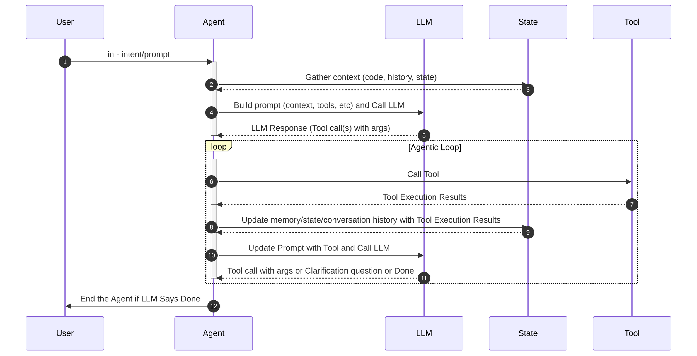

# Custom Agents in Codebolt

Codebolt is built from the ground up to support custom, code-based agents. Unlike other code editors where the agent logic is a closed "secret sauce" (or forks where the core agent behavior is buried in the editor), Codebolt exposes clear, composable APIs so you can implement and own the full agent behavior in code.

This is a fundamental difference: in Codebolt, you write the logic that drives the agent’s decision-making and execution—the **Agentic Loop**—instead of treating it as a black box.

## What is the Agentic Loop?

The **Agentic Loop** is the iterative cycle an agent follows to solve a task by perceiving context, reasoning, taking actions, and learning from results until it reaches a done state.

### How it runs in Codebolt

- Capture the user’s goal and current project context.
- Build a structured prompt with relevant code, history, and available tools.
- Call the model to reason about the next step (respond, ask, call tools, or finish).
- If tools are selected, execute them (filesystem, git, browser, tests, vector search, etc.).
- Observe results, update agent state, enrich context, and iterate.
- Stop when the model or your policy signals completion and return the final answer.

### Why exposing the Agentic Loop via APIs matters
- **Full control**: Own the reasoning and action policy. Tailor when to plan, when to execute, when to ask for clarification, and when to stop.
- **Determinism and testing**: Swap models, freeze prompts, inject mocks, and write unit/integration tests for each loop stage.
- **Composability**: Mix and match tools, memory, RAG, and evaluators. Compose multi-agent patterns or delegate to remote agents.
- **Safety and governance**: Enforce guardrails, approvals, rate limits, and sandboxed execution at the exact decision points.
- **Observability**: Instrument every loop turn—prompts, tool I/O, and state transitions—for debugging and analytics.
- **Performance tuning**: Cache sub-results, short-circuit trivial steps, batch tool calls, and control token/latency budgets.
- **Portability**: Bring your agent logic to different projects or environments without rewriting editor internals.

This page is an overview—specific API references are available elsewhere in the docs, but you don’t need them to understand the central idea: Codebolt lets you implement your own Agentic Loop, end to end.

### Agentic Loop vs. simple prompt-based editors
- **Engineered loop vs. single-shot prompts**: Codebolt agents iterate with planning, tool use, and state. Prompt-only editors send a static prompt per turn with limited control over process.
- **Actionable tools vs. plain text**: Agents execute filesystem, git, web, test, and other tools programmatically and verify results; prompt-only flows rely on manual copy-paste by the user.
- **Policy control vs. hidden heuristics**: You define stop criteria, retries, approvals, and delegation. Simple editors hide these choices inside product logic.
- **Traceable vs. opaque**: Every turn, prompt, tool call, and state change can be observed and tested. Prompt-only workflows typically expose just chat history.
- **Safer by construction**: Guardrails and sandboxes live at action boundaries. Prompt-only systems offer coarse safeguards around text generation.
- **Faster and cheaper at scale**: You can cache, batch, and short-circuit steps. One-shot prompting offers fewer levers for cost/latency control.
