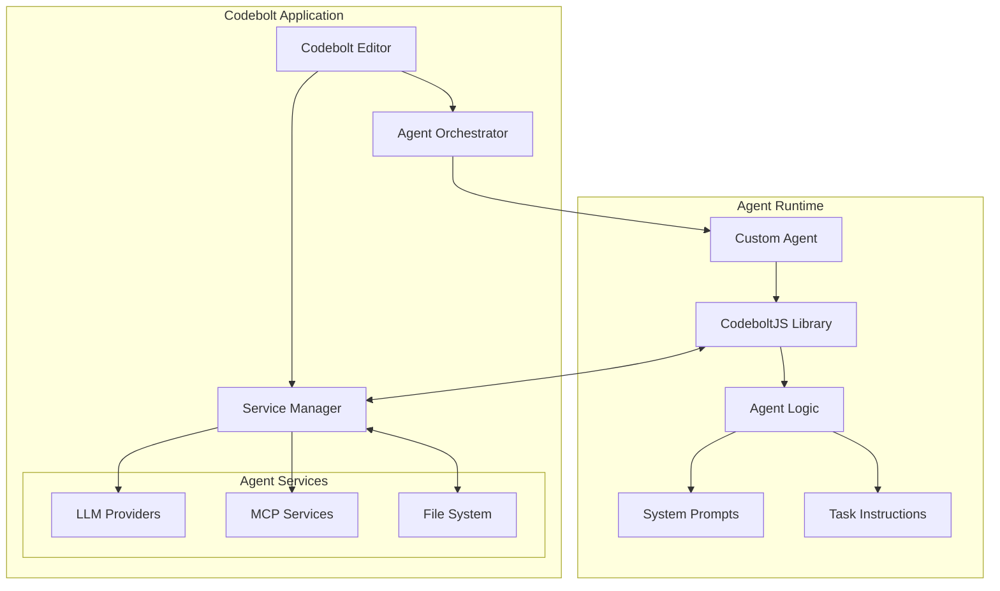

# Agent Architecture Overview

The Codebolt Agent Architecture is a sophisticated system designed to enable AI-powered development workflows through intelligent agents. This architecture provides a seamless integration between the Codebolt Editor, various services, and custom agents to deliver powerful automation capabilities.

## High-Level Architecture

Detailed architecture documentation is being developed. For now, please refer to the [Agent Introduction](../agentIntroduction.md) for basic concepts.

## Key Components

- Agent Runtime Environment
- Communication Protocols
- Tool Integration
- State Management

For immediate help, see the [QuickStart Guide](../quickstart.md).
