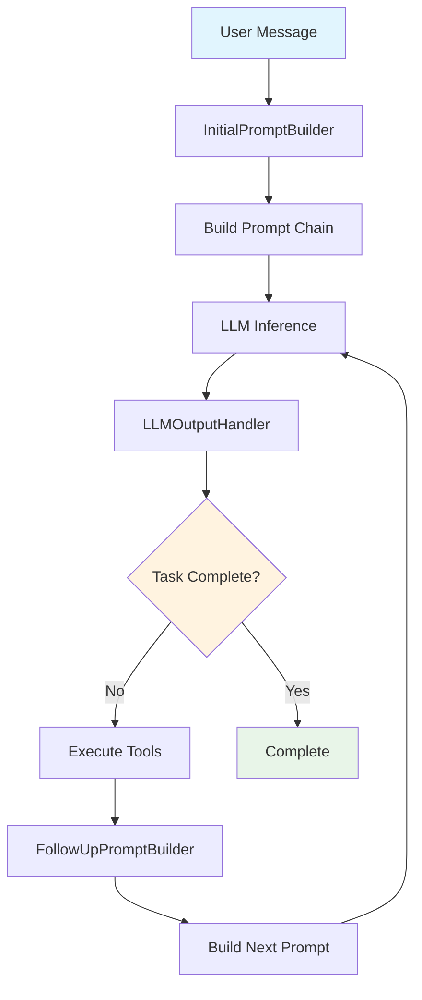

# Create AI Agent Using PromptBuilder

The advanced modular agent flow provides a sophisticated, builder-pattern-based approach to creating conversational AI agents. This method gives you full control over prompt construction, tool integration, and conversation management, making it ideal for complex, long-running, tool-heavy tasks.

## Quick Start Example

```js 
const codebolt = require('@codebolt/codeboltjs').default;
const {
  UserMessage,
  SystemPrompt,
  TaskInstruction,
  Agent,
  InitialPromptBuilder,
  LLMOutputHandler,
  FollowUpPromptBuilder
} = require("@codebolt/codeboltjs/utils");

codebolt.onMessage(async (userMessage) => {
    try {
        // Step 1: Build initial prompt with all context
        const initialPromptBuilder = new InitialPromptBuilder(userMessage, codebolt);
        let userPrompt = await initialPromptBuilder
            .addMCPTools()                              // Add external tools
            .addAgentTools()                            // Add sub-agents as tools
            .addEnvironmentDetails()                    // Add system context
            .addSystemPrompt('agent.yaml', 'test')      // Load behavior instructions
            .addTaskInstruction('task.yaml', 'main_task') // Load task definition
            .buildInferenceParams();                    // Assemble final prompt

        // Step 2: Get initial LLM response
        let llmOutput = await codebolt.llm.inference(userPrompt);
        let llmHandler = new LLMOutputHandler(llmOutput, codebolt);

        // Step 3: Continue conversation until completion
        while (!llmHandler.isCompleted()) {
            await llmHandler.sendMessageToUser();      // Send response to user
            const toolResult = await llmHandler.runTools(); // Execute any tools

            // Step 4: Build follow-up prompt with context
            const followUpPromptBuilder = new FollowUpPromptBuilder();
            userPrompt = await followUpPromptBuilder
                .addPreviousConversation(userPrompt, llmOutput)
                .addToolResult(toolResult)
                .checkAndSummarizeConversationIfLong(30)
                .build();

            // Step 5: Continue the conversation
            llmOutput = await codebolt.llm.inference(userPrompt);
            llmHandler = new LLMOutputHandler(llmOutput, codebolt);
        }

        console.log("✅ Agent workflow completed successfully.");
    } catch (error) {
        console.error("❌ Agent error:", error);
        codebolt.chat.sendMessage(error.message);
    }
});
```

## Architecture Overview

The system uses a **builder pattern** architecture with these core components:



## Core Classes

### 1. InitialPromptBuilder

The `InitialPromptBuilder` constructs the initial prompt by combining user input, system instructions, tools, and environment context using a fluent interface.

#### Constructor
```js
const builder = new InitialPromptBuilder(userMessage, codebolt);
```

**Parameters:**
- `userMessage`: Initial user message with mentioned files, tools, and agents
- `codebolt`: CodeBolt API instance for automatic tool and environment loading

#### Key Methods

##### `addMCPTools(additionalServers = ["codebolt"])`
Adds Model Context Protocol tools for external integrations.

```js
builder.addMCPTools(["codebolt", "github", "filesystem"]);
```

**What it does:**
- Loads tools from specified MCP servers
- Includes tools mentioned in the user message
- Converts MCP tools to OpenAI tool format

##### `addAgentTools()`
Converts mentioned agents into OpenAI tool format for sub-agent execution.

```js
builder.addAgentTools();
```

**What it does:**
- Finds agents mentioned in the user message
- Creates function tools with format: `subagent--{agent_id}`
- Allows the main agent to delegate tasks to specialized sub-agents

##### `addEnvironmentDetails()`
Includes system environment information in the prompt.

```js
builder.addEnvironmentDetails();
```

**What it does:**
- Adds current working directory
- Includes system information
- Provides context about the development environment

##### `addSystemPrompt(filepath, key)`
Loads system instructions from YAML configuration files.

```js
builder.addSystemPrompt('agent.yaml', 'test');
```

**Parameters:**
- `filepath`: Path to YAML file containing prompts
- `key`: Specific prompt key within the YAML file

**Example YAML structure:**
```yaml
test:
  prompt: |
    You are a helpful coding assistant.
    Follow these guidelines:
    - Always explain your reasoning
    - Provide working code examples
    - Ask clarifying questions when needed
```

##### `addTaskInstruction(filepath, section)`
Loads task-specific instructions from YAML files.

```js
builder.addTaskInstruction('task.yaml', 'main_task');
```

**Example YAML structure:**
```yaml
main_task:
  instruction: |
    Your task is to help users with coding problems.
    Steps to follow:
    1. Analyze the user's request
    2. Provide a solution
    3. Explain the implementation
```

##### `buildInferenceParams()`
Assembles all components into the final prompt structure for LLM inference.

```js
const prompt = await builder.buildInferenceParams();
```

**Returns:**
```js
{
    full: true,
    messages: [...],  // OpenAI message format
    tools: [...],     // Available tools
    tool_choice: "auto"
}
```

#### Advanced Usage

##### Custom Tool Loading
```js
const builder = new InitialPromptBuilder(userMessage, codebolt);

// Load specific MCP servers
await builder.addMCPTools(["github", "jira", "slack"]);

// Add custom tools
builder.addCustomTools([
    {
        type: "function",
        function: {
            name: "custom_tool",
            description: "My custom tool",
            parameters: { /* ... */ }
        }
    }
]);
```

##### Conditional Building
```js
const builder = new InitialPromptBuilder(userMessage, codebolt);

if (userMessage.mentionedFiles.length > 0) {
    builder.addFileContents();
}

if (userMessage.mentionedAgents.length > 0) {
    builder.addAgentTools();
}

const prompt = await builder.buildInferenceParams();
```

### 2. LLMOutputHandler

The `LLMOutputHandler` processes LLM responses, manages tool execution, and determines conversation completion.

#### Constructor
```js
const handler = new LLMOutputHandler(llmResponse, codebolt);
```

**Parameters:**
- `llmResponse`: Response object from LLM inference
- `codebolt`: CodeBolt API instance for tool execution

#### Key Methods

##### `isCompleted()`
Checks if the task/conversation has been completed.

```js
if (handler.isCompleted()) {
    console.log("Task finished!");
}
```

**Returns:** `boolean` - True if no more tool calls are needed

##### `sendMessageToUser()`
Sends the assistant's response to the user interface.

```js
await handler.sendMessageToUser();
```

**What it does:**
- Extracts message content from LLM response
- Sends to chat interface via `codebolt.chat.sendMessage()`
- Handles different response formats (OpenAI, direct content, etc.)

##### `runTools()`
Executes all tool calls found in the LLM response.

```js
const toolResults = await handler.runTools();
```

**Returns:** `Array<ToolResult>` - Results from tool executions

**Tool execution flow:**
1. Parses tool calls from LLM response
2. Executes each tool via appropriate handler
3. Handles sub-agent execution specially
4. Returns formatted results for conversation

##### `getToolResults()`
Returns the results from the last tool execution.

```js
const results = handler.getToolResults();
```

#### Tool Execution Details

The handler supports different types of tools:

**MCP Tools:**
```js
// Format: toolbox--toolname
await codebolt.mcp.executeTool("github", "create_issue", {
    title: "Bug report",
    body: "Description of the bug"
});
```

**Sub-agents:**
```js
// Format: subagent--agent_id
await codeboltAgent.startAgent("code_reviewer", "Review this function");
```

**Built-in Tools:**
```js
// Special completion tool
{
    function: {
        name: "attempt_completion",
        arguments: '{"result": "Task completed successfully"}'
    }
}
```

### 3. FollowUpPromptBuilder

The `FollowUpPromptBuilder` manages conversation continuity, handles context preservation, and prevents token limit issues through intelligent summarization.

#### Constructor
```js
const followUpBuilder = new FollowUpPromptBuilder(codebolt);
```

#### Key Methods

##### `addPreviousConversation(previousPrompt, llmResponse)`
Maintains conversation history by adding the previous prompt and LLM response.

```js
followUpBuilder.addPreviousConversation(userPrompt, llmOutput);
```

**Parameters:**
- `previousPrompt`: The prompt object with messages and tools
- `llmResponse`: The LLM response to add to history

##### `addToolResult(toolResults)`
Incorporates tool execution results into the conversation.

```js
followUpBuilder.addToolResult(toolResults);
```

**What it does:**
- Adds each tool result as a separate message
- Includes tool call IDs for proper conversation flow
- Adds continuation prompt if no tools were executed

##### `checkAndSummarizeConversationIfLong(maxLength)`
Manages conversation length and triggers summarization when needed.

```js
followUpBuilder.checkAndSummarizeConversationIfLong(30);
```

**Parameters:**
- `maxLength`: Maximum number of messages before summarization

**Summarization process:**
1. Checks if conversation exceeds max length
2. Uses `chatSummary.summarize()` to create summary
3. Preserves system messages and recent context
4. Replaces middle messages with summary

##### `build()`
Assembles the follow-up prompt with all context.

```js
const nextPrompt = await followUpBuilder.build();
```

**Returns:** Complete prompt object ready for LLM inference

#### Advanced Conversation Management

##### Custom Summarization
```js
const followUpBuilder = new FollowUpPromptBuilder(codebolt);

// Custom summarization threshold
followUpBuilder.checkAndSummarizeConversationIfLong(50);

// Force summarization
followUpBuilder.forceSummarization = true;
```

##### Context Preservation
```js
// The builder automatically preserves:
// - System messages
// - Recent messages (last 5)
// - Tool results
// - User corrections
```

### 4. Supporting Classes

#### SystemPrompt

Loads system instructions from YAML files to provide consistent behavior guidelines.

```js
const systemPrompt = new SystemPrompt('prompts/agent.yaml', 'coding_assistant');
const promptText = systemPrompt.toPromptText();
```

**YAML Example:**
```yaml
coding_assistant:
  prompt: |
    You are an expert coding assistant specialized in JavaScript and TypeScript.
    
    Guidelines:
    - Always provide working, tested code
    - Explain complex concepts clearly
    - Ask for clarification when requirements are unclear
    - Follow best practices and coding standards
    
    When helping with debugging:
    1. Analyze the error message
    2. Identify the root cause
    3. Provide a fix with explanation
    4. Suggest prevention strategies
```

#### TaskInstruction

Manages task-specific instructions and converts them to prompt format.

```js
const task = new TaskInstruction(tools, userMessage, 'tasks/coding.yaml', 'debug_task');
const promptContent = await task.toPrompt();
```

**YAML Example:**
```yaml
debug_task:
  instruction: |
    Help the user debug their code by:
    1. Analyzing the provided code and error
    2. Identifying the issue
    3. Providing a corrected version
    4. Explaining what went wrong and how to prevent it
  
  tools_required:
    - code_analyzer
    - syntax_checker
    - test_runner
```

#### UserMessage

Processes and manages user messages, handling file mentions, tool references, and agent calls.

```js
const userMsg = new UserMessage(messageData);
const mentionedTools = await userMsg.getMentionedMcpsTools();
const mentionedAgents = await userMsg.getMentionedAgents();
```

## Configuration Files

### agent.yaml
Contains system prompts and agent behavior configuration.

```yaml
# System prompts for different agent types
coding_assistant:
  prompt: |
    You are a helpful coding assistant...
    
debugging_agent:
  prompt: |
    You specialize in debugging and error resolution...
    
code_reviewer:
  prompt: |
    You are a thorough code reviewer...
```

### task.yaml
Defines specific task instructions and workflows.

```yaml
# Task definitions
main_task:
  instruction: |
    Your primary task is to help users with their coding needs...
    
code_review:
  instruction: |
    Review the provided code for:
    1. Correctness
    2. Performance
    3. Security
    4. Best practices
    
bug_fix:
  instruction: |
    Analyze the bug report and:
    1. Reproduce the issue
    2. Identify root cause
    3. Implement fix
    4. Test solution
```

## Advanced Usage Patterns

### 1. Custom Tool Integration

```js
const builder = new InitialPromptBuilder(userMessage, codebolt);

// Add custom MCP servers
builder.addMCPTools(["custom-server", "enterprise-tools"]);

// Add custom function tools
builder.addCustomTools([
    {
        type: "function",
        function: {
            name: "deploy_application",
            description: "Deploy application to specified environment",
            parameters: {
                type: "object",
                properties: {
                    environment: { type: "string", enum: ["dev", "staging", "prod"] },
                    version: { type: "string" }
                },
                required: ["environment", "version"]
            }
        }
    }
]);
```

### 2. Multi-Agent Orchestration

```js
// Main agent delegates to specialized sub-agents
const builder = new InitialPromptBuilder(userMessage, codebolt);
builder.addAgentTools(); // Converts mentioned agents to tools

// Sub-agents can be called like:
// subagent--code_reviewer: Reviews code quality
// subagent--security_scanner: Scans for security issues
// subagent--performance_analyzer: Analyzes performance bottlenecks
```

### 3. Conditional Workflow

```js
codebolt.onMessage(async (userMessage) => {
    const builder = new InitialPromptBuilder(userMessage, codebolt);
    
    // Conditional tool loading based on message content
    if (userMessage.text.includes("debug")) {
        builder.addSystemPrompt('agent.yaml', 'debugging_agent');
        builder.addTaskInstruction('task.yaml', 'debug_task');
    } else if (userMessage.text.includes("review")) {
        builder.addSystemPrompt('agent.yaml', 'code_reviewer');
        builder.addTaskInstruction('task.yaml', 'code_review');
    } else {
        builder.addSystemPrompt('agent.yaml', 'coding_assistant');
        builder.addTaskInstruction('task.yaml', 'main_task');
    }
    
    // Continue with standard workflow...
});
```

### 4. Error Handling and Recovery

```js
codebolt.onMessage(async (userMessage) => {
    try {
        const builder = new InitialPromptBuilder(userMessage, codebolt);
        let userPrompt = await builder.buildInferenceParams();
        
        let llmOutput = await codebolt.llm.inference(userPrompt);
        let llmHandler = new LLMOutputHandler(llmOutput, codebolt);
        
        while (!llmHandler.isCompleted()) {
            try {
                await llmHandler.sendMessageToUser();
                const toolResult = await llmHandler.runTools();
                
                // Handle tool execution errors
                const failedTools = toolResult.filter(r => r.error);
                if (failedTools.length > 0) {
                    console.warn("Some tools failed:", failedTools);
                    // Add error context to next prompt
                }
                
                const followUpBuilder = new FollowUpPromptBuilder();
                userPrompt = await followUpBuilder
                    .addPreviousConversation(userPrompt, llmOutput)
                    .addToolResult(toolResult)
                    .checkAndSummarizeConversationIfLong(30)
                    .build();
                
                llmOutput = await codebolt.llm.inference(userPrompt);
                llmHandler = new LLMOutputHandler(llmOutput, codebolt);
                
            } catch (stepError) {
                console.error("Step error:", stepError);
                // Send error to user and continue
                codebolt.chat.sendMessage(`Error occurred: ${stepError.message}`);
                break;
            }
        }
        
    } catch (error) {
        console.error("❌ Agent error:", error);
        codebolt.chat.sendMessage(`I encountered an error: ${error.message}`);
    }
});
```

## Best Practices

### 1. Prompt Design
- Keep system prompts focused and specific
- Use clear, actionable instructions
- Include examples when helpful
- Separate concerns (system vs task instructions)

### 2. Tool Management
- Load only necessary tools to reduce token usage
- Use descriptive tool names and descriptions
- Handle tool failures gracefully
- Implement proper error reporting

### 3. Conversation Management
- Set appropriate summarization thresholds
- Preserve important context during summarization
- Monitor conversation length and token usage
- Handle edge cases (empty responses, malformed tools)

### 4. Performance Optimization
- Cache frequently used prompts and tools
- Use parallel tool execution when possible
- Implement proper timeout handling
- Monitor and log performance metrics

## Troubleshooting

### Common Issues

**Tool execution failures:**
```js
// Check tool availability
const availableTools = await codebolt.mcp.listMcpFromServers(["codebolt"]);
console.log("Available tools:", availableTools);

// Validate tool parameters
const toolResult = await handler.runTools();
const errors = toolResult.filter(r => r.error);
if (errors.length > 0) {
    console.error("Tool errors:", errors);
}
```

**Conversation length issues:**
```js
// Monitor conversation length
const followUpBuilder = new FollowUpPromptBuilder();
followUpBuilder.checkAndSummarizeConversationIfLong(20); // Lower threshold

// Force summarization
followUpBuilder.forceSummarization = true;
```

**Memory and performance:**
```js
// Monitor token usage
console.log("Conversation length:", builder.getConversationLength());
console.log("Should summarize:", builder.shouldSummarizeConversation(30));

// Reset handlers when needed
llmHandler.reset();
```

This advanced modular agent flow provides a powerful, flexible foundation for building sophisticated conversational AI systems that can handle complex tasks, integrate with external tools, and maintain context across long conversations.

