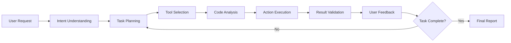

# What is a Codebolt Agent?

A **Codebolt Agent** is an intelligent AI assistant that leverages Codebolt's comprehensive APIs to interact with your code editor and development environment. Think of agents as specialized AI developers that can understand your requirements, analyze code, make decisions, and execute complex development tasks autonomously.

## Key Characteristics

### 🤖 **Intelligent Automation**
Codebolt agents go beyond simple code completion. They can:
- Understand natural language requirements
- Analyze existing codebases
- Make intelligent decisions about code structure
- Execute multi-step development workflows
- Handle complex refactoring and optimization tasks

### 🛠️ **Full Editor Control**
Unlike traditional AI coding assistants, Codebolt agents have complete access to:
- **File System Operations** - Create, read, update, and delete files
- **Code Analysis** - Parse ASTs, understand code structure
- **Git Operations** - Commit, branch, merge, and version control
- **Terminal Commands** - Execute build scripts, tests, and deployments
- **Browser Automation** - Test and interact with web applications
- **Project Management** - Handle dependencies, configurations, and environments

### 🔧 **Extensible Architecture**
Agents are built using a modular, code-based approach that allows:
- Custom logic implementation
- Integration with external APIs and services
- Tool composition and chaining
- Workflow orchestration
- Real-time adaptation to project needs

## How Agents Differ from Other AI Assistants

| Feature | Traditional AI Assistants | Codebolt Agents |
|---------|---------------------------|-----------------|
| **Interaction Model** | Chat-based suggestions | Direct editor manipulation |
| **Scope** | Single file/function | Entire project ecosystem |
| **Execution** | Manual copy-paste | Autonomous task execution |
| **Customization** | Prompt modification only | Full code-based customization |
| **Integration** | Limited tool access | Complete development environment |

## Agent Workflow Process

Codebolt agents operate through a sophisticated agentic process:

1. **Intent Understanding** - Parse and interpret user requirements
2. **Task Planning** - Break down complex tasks into actionable steps
3. **Tool Selection** - Choose appropriate APIs and services
4. **Code Analysis** - Understand existing codebase structure
5. **Action Execution** - Perform file operations, code changes, and system commands
6. **Result Validation** - Verify changes and test functionality
7. **User Feedback** - Provide progress updates and results
8. **Iteration** - Refine and continue until task completion

## Core Components

### 🏗️ **Agent Architecture**
Understanding the technical foundation and design patterns that power Codebolt agents.

**[→ Learn about Agent Architecture](./1_architecture.md)**

- System architecture and component interaction
- Service layer and API integration
- Agent runtime environment
- Communication protocols and data flow

### 🚀 **Creating Agents**
Step-by-step guide to building your own custom agents using the Codebolt framework.

**[→ Learn how to Create Agents](./createagent.md)**

- PromptBuilder pattern and modular design
- Tool integration and workflow orchestration
- Conversation management and context handling
- Advanced agent development techniques

## Agent Types

### **Custom Code Agents**
Full-featured agents built with JavaScript/TypeScript that provide:
- Complete control over agent behavior
- Custom business logic implementation
- Integration with external systems
- Advanced workflow orchestration

### **Remix Agents**
Simplified agents created through configuration that offer:
- Quick setup and deployment
- Prompt-based customization
- Pre-built tool integration
- Ideal for common development tasks

## Getting Started

Ready to dive deeper into Codebolt agents? Explore these essential topics:

1. **[Architecture Overview](./1_architecture.md)** - Understand the technical foundation
2. **[Create Your First Agent](./createagent.md)** - Build a custom agent from scratch
3. **[Agent Introduction](../agentIntroduction.md)** - Comprehensive overview and concepts
4. **[Using Agents](../2_usingagents/index.md)** - Learn how to run and manage agents

---

*Codebolt agents represent the future of AI-powered development - where intelligent assistants don't just suggest code, but actively participate in the entire development lifecycle.* 