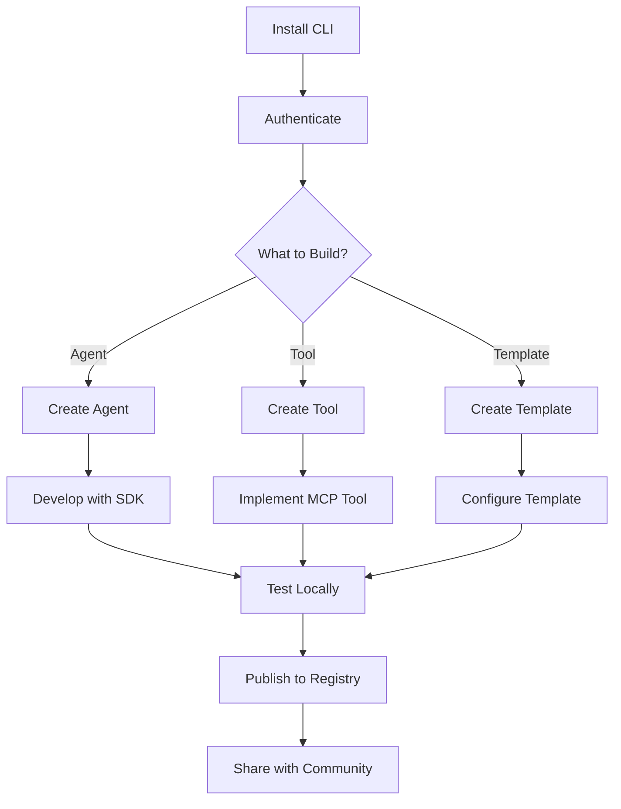

# Developer Guide

Welcome to the Codebolt Developer Guide! This comprehensive guide provides everything you need to build, extend, and customize the Codebolt platform. Whether you're creating intelligent AI agents, developing custom tools, or building application templates, this guide will help you leverage Codebolt's powerful ecosystem.

## Main Components

### 🤖 [Agents](./agents/agentIntroduction.md)
**Build intelligent AI assistants that control your entire development environment**

Codebolt agents are the core of the platform - intelligent AI assistants that leverage Codebolt's APIs to interact with your code editor. Unlike other editors that limit you to predefined prompts and tools, Codebolt provides actual editor APIs for complete programmatic control.

**Key Features:**
- **Full Editor Control**: Like Selenium for browsers, but for code editors
- **Custom Logic**: Write code-based agents with custom workflows and processes
- **Multi-Agent Support**: Orchestrate multiple agents for complex tasks
- **Agentic Architecture**: Combines user intent understanding, task planning, and intelligent decision making

**What You'll Learn:**
- [Agent Architecture](./agents/1_agentarchitecture/1_architecture.md) - Understanding the core architecture
- [Creating Custom Agents](./agents/3_customagents/3_firstExtension.md) - Build your first agent from scratch
- [Remix Agents](./agents/4_remixagents/aboutremixagents.md) - Quick cursor-style agent creation
- [Multi-Agent Systems](./agents/multi-agent.md) - Orchestrating multiple agents

---

### 🛠️ [Tools](./tools/overview.md)
**Extend agent capabilities with custom MCP-compatible utilities**

Codebolt Tools are custom utilities built on the Model Context Protocol (MCP) standard that extend agent capabilities. They provide specialized functionality for external integrations, automation, and domain-specific tasks.

**Key Features:**
- **MCP Compatible**: Full backward compatibility with existing MCP implementations
- **Reusable**: Share tools across multiple agents and projects
- **Configurable**: Accept parameters for customization
- **Registry Integration**: Publish and discover tools in the community

**What You'll Learn:**
- [Creating Tools](./tools/create_tool.md) - Build custom tools from scratch
- [Tool Registry](./tools/tool_registry.md) - Publish and discover tools
- [Testing Tools](./tools/testlocalmcp.md) - Local development and testing
- [Publishing Tools](./tools/publish_tool.md) - Share your tools with the community

---

### 💻 [CLI](./cli/overview.md)
**Command-line interface for agent and tool management**

The Codebolt CLI is a powerful Node.js-based command-line tool that enables developers to create, manage, and deploy Codebolt agents and tools. It provides a complete development workflow from creation to deployment.

**Key Features:**
- **Agent Lifecycle Management**: Create, publish, pull, start, and clone agents
- **Tool Development**: Create and manage custom MCP tools
- **Authentication**: Secure login/logout functionality
- **Project Organization**: Manage projects in structured directories

**What You'll Learn:**
- [Installation](./cli/installation.md) - Get the CLI installed and configured
- [Authentication](./cli/authentication.md) - Set up your Codebolt account
- [Agent Management](./cli/agents.md) - Create and manage agents via CLI
- [Tool Development](./cli/tools.md) - Build and test tools locally
- [Command Reference](./cli/commands.md) - Complete command documentation

---

### 📚 [TypeScript SDK](./typescriptSdk/overview.md)
**Comprehensive library for building powerful Codebolt integrations**

The CodeboltJS TypeScript SDK (`@codebolt/codeboltjs`) is the core library that powers Codebolt agents. It provides a unified interface to interact with various platform capabilities through 20+ specialized modules.

**Key Features:**
- **Comprehensive Modules**: File system, terminal, browser, Git, LLM, and more
- **Agent Framework**: High-level Agent class for building sophisticated AI workflows
- **Type Safety**: Full TypeScript support with comprehensive type definitions
- **Real-time Communication**: WebSocket-based bidirectional communication

**What You'll Learn:**
- [Installation & Setup](./typescriptSdk/installation.md) - Get started with the SDK
- [Core Modules](./typescriptSdk/core-modules.md) - Explore available functionality
- [Agent Framework](./typescriptSdk/agent-framework.md) - Build sophisticated agents
- [API Reference](./typescriptSdk/api-reference.md) - Complete API documentation

---

### 📋 [Templates](2_Docs/templates/overview.md)
**Pre-configured application blueprints for rapid development**

Codebolt Templates are reusable project templates that provide complete application blueprints with best practices, configurations, and development workflows. They enable rapid bootstrapping of new projects.

**Key Features:**
- **Complete Project Structure**: Pre-organized folders, files, and configurations
- **Multiple Types**: Frontend, backend, full-stack, and specialized templates
- **Best Practices**: Industry-standard patterns and security configurations
- **Registry Integration**: Publish and discover templates in the community

**What You'll Learn:**
- [Creating Templates](creating-templates.md) - Build reusable project templates
- [Configuration](configuration.md) - Set up codeboltconfig.yaml
- [Best Practices](best-practices.md) - Follow industry standards
- [Publishing](publishing.md) - Share templates with the community

---

## Getting Started

### For New Developers
1. **Start with [Agents](./agents/quickstart.md)** - Learn the core concepts and create your first agent
2. **Install the [CLI](./cli/installation.md)** - Set up your development environment
3. **Explore [Templates](2_Docs/templates/overview.md)** - Use existing templates to bootstrap projects
4. **Build [Tools](./tools/quickstart.md)** - Extend functionality with custom tools

### For Experienced Developers
1. **Deep dive into the [TypeScript SDK](./typescriptSdk/overview.md)** - Leverage the full power of the platform
2. **Create [Custom Agents](./agents/3_customagents/3_firstExtension.md)** - Build sophisticated AI workflows
3. **Develop [Advanced Tools](./tools/create_tool.md)** - Create specialized utilities
4. **Contribute [Templates](creating-templates.md)** - Share best practices with the community

## Development Workflow

## Community and Support

- **GitHub**: [Codebolt Organization](https://github.com/codeboltai)
- **Discord**: [Join our community](https://discord.gg/codebolt)
- **Registry**: [Browse agents, tools, and templates](https://portal.codebolt.ai)
- **Documentation**: [Complete documentation](https://docs.codebolt.ai)

## What Makes Codebolt Different?

Codebolt is built from the ground up for the AI-agentic era, providing:

- **Full Editor Control**: Unlike other editors that limit customization to prompts, Codebolt provides complete programmatic control
- **Code-Based Agents**: Write actual code with custom logic, workflows, and processes
- **MCP Compatibility**: Full support for the Model Context Protocol standard
- **Extensible Architecture**: Every component can be extended, customized, and shared
- **Community-Driven**: Open ecosystem where developers can share and discover solutions

Ready to start building? Choose your path above and dive into the Codebolt ecosystem!