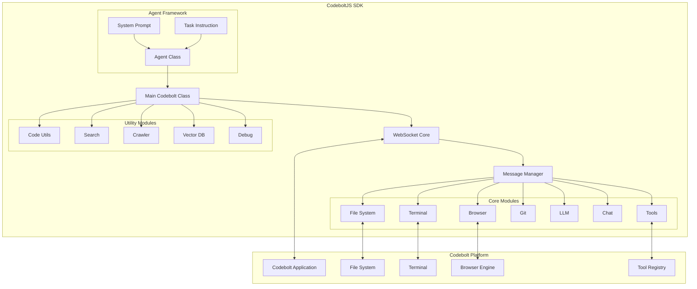

# CodeboltJS TypeScript SDK

The CodeboltJS TypeScript SDK (`@codebolt/codeboltjs`) is a comprehensive library that enables developers to create powerful AI agents that integrate seamlessly with the Codebolt platform. This SDK provides a unified interface to interact with various platform capabilities including file system operations, LLM interactions, terminal commands, browser automation, and much more.

## What is CodeboltJS?

CodeboltJS is the core library that powers Codebolt agents. It provides:

- **WebSocket Communication**: Real-time bidirectional communication with the Codebolt application
- **Modular Architecture**: 20+ specialized modules for different functionalities
- **Type Safety**: Full TypeScript support with comprehensive type definitions
- **Tool Integration**: Built-in support for MCP (Model Context Protocol) tools
- **Agent Framework**: High-level Agent class for building sophisticated AI workflows

## Key Features

### 🔧 **Comprehensive Module System**
- **File System**: Read, write, create, delete files and folders
- **Terminal**: Execute commands with streaming output support
- **Browser**: Automate web interactions and scraping
- **Git**: Complete Git operations integration
- **LLM**: Multi-provider language model interactions
- **Tools**: MCP-compatible tool discovery and execution
- **Chat**: Real-time communication with users
- **And 15+ more specialized modules**

### 🤖 **Agent Framework**
- High-level Agent class for complex workflows
- Tool calling and execution management
- Conversation history management
- Task completion detection
- Sub-agent orchestration

### 🔌 **Platform Integration**
- Seamless integration with Codebolt application
- Real-time file system synchronization
- User interaction capabilities
- Progress tracking and notifications

## Installation

### For Agent Development

```bash
# Install the SDK in your agent project
npm install @codebolt/codeboltjs

# Or using yarn
yarn add @codebolt/codeboltjs
```

### For CLI-based Development

```bash
# Create a new agent using Codebolt CLI
npx codebolt-cli createagent

# The SDK is automatically included in the generated template
```

## Quick Start

### Basic Agent Structure

```typescript
import codebolt from '@codebolt/codeboltjs';

// Wait for WebSocket connection
await codebolt.waitForConnection();

// Set up message handler
codebolt.onMessage(async (userMessage) => {
    // Handle user requests
    const response = await processUserRequest(userMessage);
    return response;
});

async function processUserRequest(message: any) {
    // Read project files
    const files = await codebolt.fs.listFile('./', true);
    
    // Execute terminal commands
    const result = await codebolt.terminal.executeCommand('npm test');
    
    // Interact with LLM
    const llmResponse = await codebolt.llm.inference(
        'Analyze this code and suggest improvements',
        'code-reviewer'
    );
    
    return `Task completed: ${llmResponse.message}`;
}
```

### Using the Agent Framework

```typescript
import { Agent, SystemPrompt, TaskInstruction } from '@codebolt/codeboltjs';

// Create system prompt
const systemPrompt = new SystemPrompt(`
You are a React development expert. Help users create and modify React components.
Always follow best practices and modern React patterns.
`);

// Initialize agent with tools
const agent = new Agent([], systemPrompt, 10);

// Create task instruction
const task = new TaskInstruction(userMessage);

// Run the agent
const result = await agent.run(task);
```

## SDK Architecture



## Available Modules

| Module | Description | Key Functions |
|--------|-------------|---------------|
| **fs** | File system operations | `readFile`, `writeFile`, `createFile`, `listFile` |
| **terminal** | Command execution | `executeCommand`, `executeCommandWithStream` |
| **browser** | Web automation | `goToPage`, `getHTML`, `screenshot`, `click` |
| **git** | Git operations | `status`, `commit`, `push`, `pull`, `branch` |
| **llm** | Language model interactions | `inference` |
| **chat** | User communication | `sendMessage`, `getChatHistory`, `askQuestion` |
| **tools** | MCP tool integration | `listToolsFromToolBoxes`, `executeTool` |
| **codeutils** | Code analysis | `parseCode`, `extractFunctions`, `getImports` |
| **search** | Content search | `searchInFiles`, `findReferences` |
| **crawler** | Web crawling | `crawlWebsite`, `extractLinks` |
| **vectordb** | Vector operations | `store`, `search`, `similarity` |
| **project** | Project management | `getProjectInfo`, `analyzeStructure` |
| **dbmemory** | Persistent storage | `store`, `retrieve`, `update` |
| **state** | State management | `setState`, `getState`, `clearState` |
| **debug** | Debugging utilities | `log`, `trace`, `profile` |
| **tokenizer** | Text tokenization | `tokenize`, `countTokens` |

## Message Flow

The SDK uses a WebSocket-based communication pattern:

```typescript
// 1. Agent sends request to platform
const response = await codebolt.fs.readFile('./package.json');

// 2. Platform processes request and returns response
// 3. SDK handles response and returns to agent

// For streaming operations:
const stream = codebolt.terminal.executeCommandWithStream('npm install');
stream.on('commandOutput', (data) => {
    console.log(data.message);
});
```

## Error Handling

The SDK provides comprehensive error handling:

```typescript
try {
    const fileContent = await codebolt.fs.readFile('./nonexistent.txt');
} catch (error) {
    if (error.type === 'FileNotFound') {
        // Handle file not found
        await codebolt.fs.createFile('nonexistent.txt', 'default content', './');
    }
}
```

## Best Practices

### 1. **Connection Management**
```typescript
// Always wait for connection before using SDK
await codebolt.waitForConnection();
```

### 2. **Error Handling**
```typescript
// Wrap SDK calls in try-catch blocks
try {
    const result = await codebolt.terminal.executeCommand('risky-command');
} catch (error) {
    await codebolt.chat.sendMessage(`Error: ${error.message}`);
}
```

### 3. **Resource Cleanup**
```typescript
// Clean up streaming operations
const stream = codebolt.terminal.executeCommandWithStream('long-running-task');
// ... use stream
if (stream.cleanup) {
    stream.cleanup();
}
```

### 4. **User Communication**
```typescript
// Keep users informed of progress
await codebolt.chat.sendMessage('Starting file analysis...');
const files = await codebolt.fs.listFile('./', true);
await codebolt.chat.sendMessage(`Found ${files.length} files to analyze`);
```

## Next Steps

- **[Installation & Setup](./installation.md)** - Detailed installation and configuration
- **[Core Modules](./core-modules.md)** - Deep dive into essential modules
- **[Agent Framework](./agent-framework.md)** - Building sophisticated agents
- **[API Reference](./api-reference.md)** - Complete function documentation
- **[Examples](./examples.md)** - Practical implementation examples
- **[Examples](./examples.md)** - Advanced patterns and techniques

## Support

- **Documentation**: [https://codeboltai.github.io](https://codeboltai.github.io)
- **GitHub**: [https://github.com/codeboltai/codeboltjs](https://github.com/codeboltai/codeboltjs)
- **Community**: Join our Discord for support and discussions

---

The CodeboltJS SDK empowers developers to create intelligent, capable agents that can perform complex development tasks with ease. Start building your first agent today!
